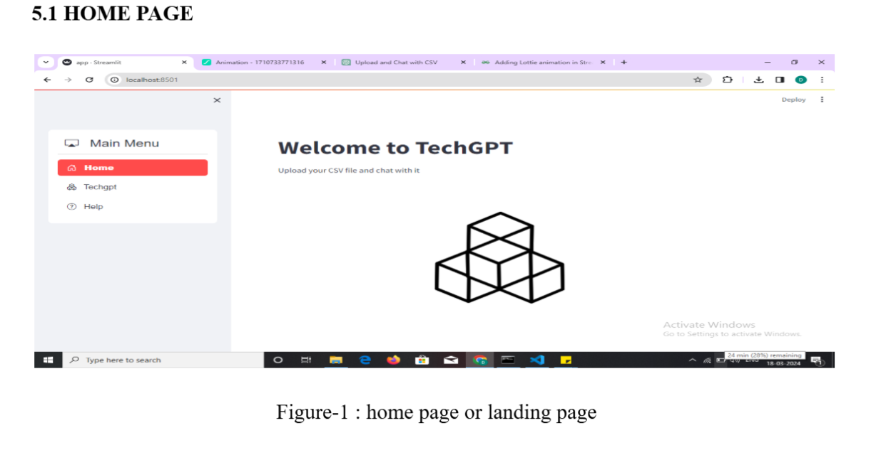
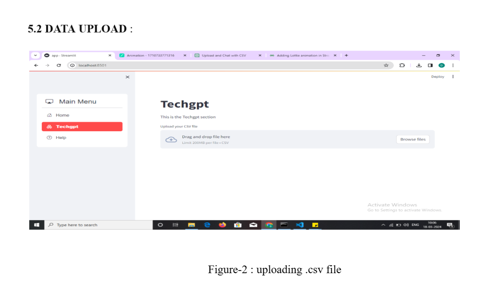
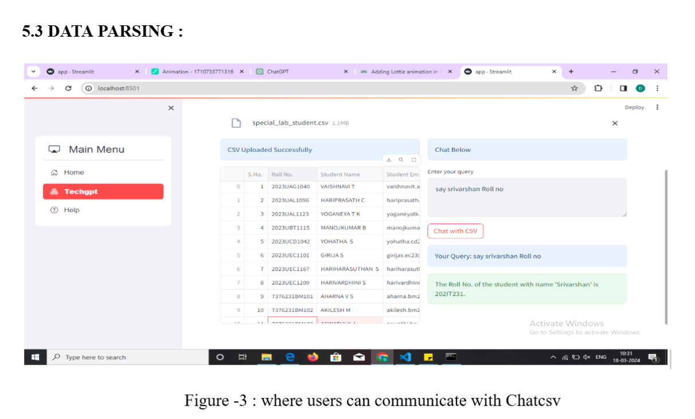
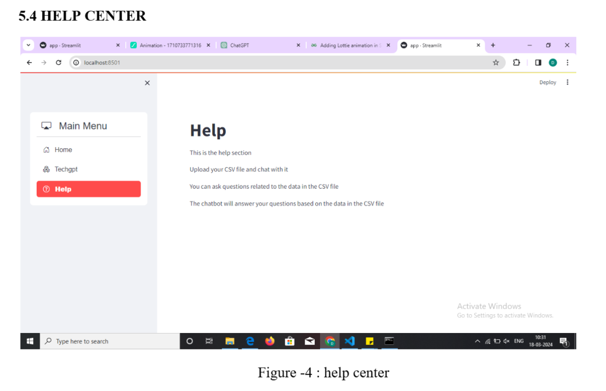

# 📊 TechGPT – Chat with Your CSV Data

**TechGPT** is a Streamlit-based web application that enables users to interactively explore and analyze CSV datasets using natural language queries. By uploading a CSV file, users can ask questions about their data, and TechGPT will provide immediate, insightful responses powered by OpenAI's GPT model.

---

## 🚀 Features

- **Natural Language Interaction**: Query your data using everyday language without needing to write code.
- **Instant Insights**: Receive immediate answers and summaries based on your dataset.
- **User-Friendly Interface**: Simple and intuitive design for seamless user experience.
- **Secure API Integration**: Easily integrate your OpenAI API key for personalized responses.

---

## 🛠️ Tech Stack

- **Frontend**: [Streamlit](https://streamlit.io/)
- **Backend**: Python
- **AI Model**: OpenAI GPT (via API)
- **Data Handling**: Pandas

---

## 📂 Installation & Setup

1. **Clone the Repository**:
   ```bash
   git clone https://github.com/DANUSHMATHI2002/TechGPT.git
   cd TechGPT
   ```

2. **Create a Virtual Environment** (optional but recommended):
   ```bash
   python -m venv venv
   source venv/bin/activate  # On Windows: venv\Scripts\activate
   ```

3. **Install Dependencies**:
   ```bash
   pip install -r requirements.txt
   ```

4. **Set Up OpenAI API Key**:
   - Obtain your API key from [OpenAI](https://platform.openai.com/account/api-keys).
   - Create a `.env` file in the project root directory and add:
     ```env
     OPENAI_API_KEY=your_api_key_here
     ```

5. **Run the Application**:
   ```bash
   streamlit run app.py
   ```

6. **Access the App**:
   - Navigate to `http://localhost:8501` in your web browser.

---

## 📸 Screenshots

### 🖥️ Main Interface


### 📁 Upload CSV File


### 🤖 Ask Questions


### 📊 Help centre


---

## 🤖 How It Works

1. **Upload CSV**: Users upload a CSV file containing their dataset.
2. **Ask Questions**: Users input natural language questions related to the data.
3. **Get Answers**: The app processes the query using OpenAI's GPT model and returns relevant information or analysis.

---

## 📈 Example Use Cases

- **Data Exploration**: Quickly understand the contents and structure of your dataset.
- **Statistical Analysis**: Obtain summaries, averages, and other statistical insights.
- **Data Cleaning**: Identify missing values or anomalies in the data.
- **Custom Queries**: Ask specific questions tailored to your dataset's context.

---

## 🧾 See the Video Demo

Check Here: https://drive.google.com/file/d/1dQ7Dsz2vjFC8KtG_jzFYmQ2A_ciABwXI/view?usp=sharing 

---

## 🙋‍♂️ Author

Developed by [Danushmathi P](https://github.com/DANUSHMATHI2002).  
Feel free to connect on [LinkedIn](https://www.linkedin.com/in/danushmathip/).

---
