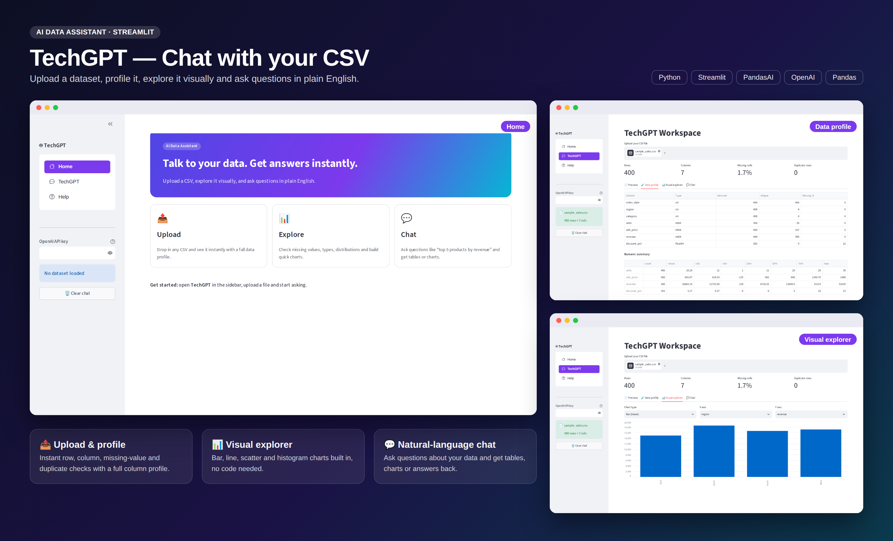
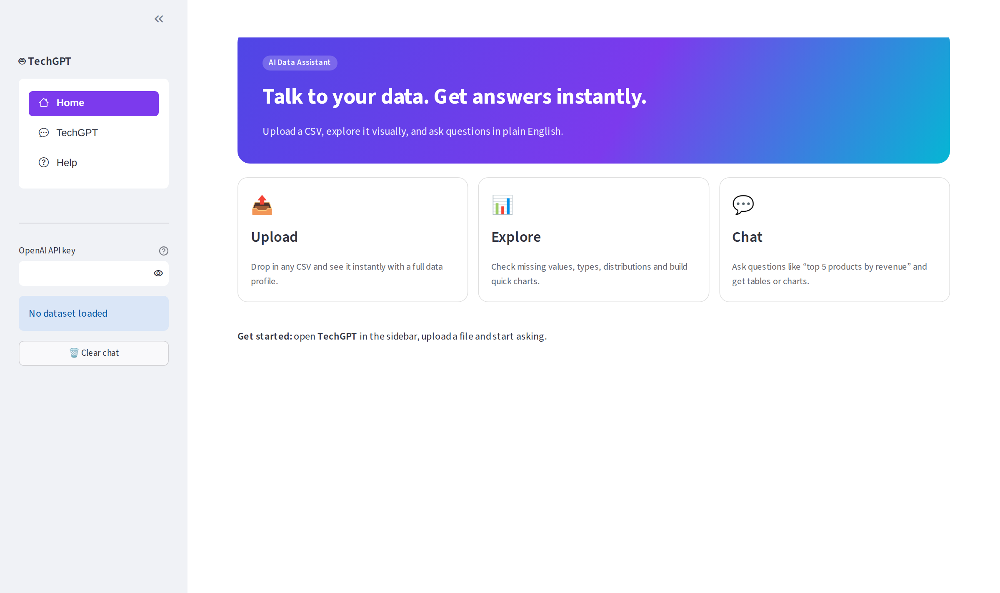
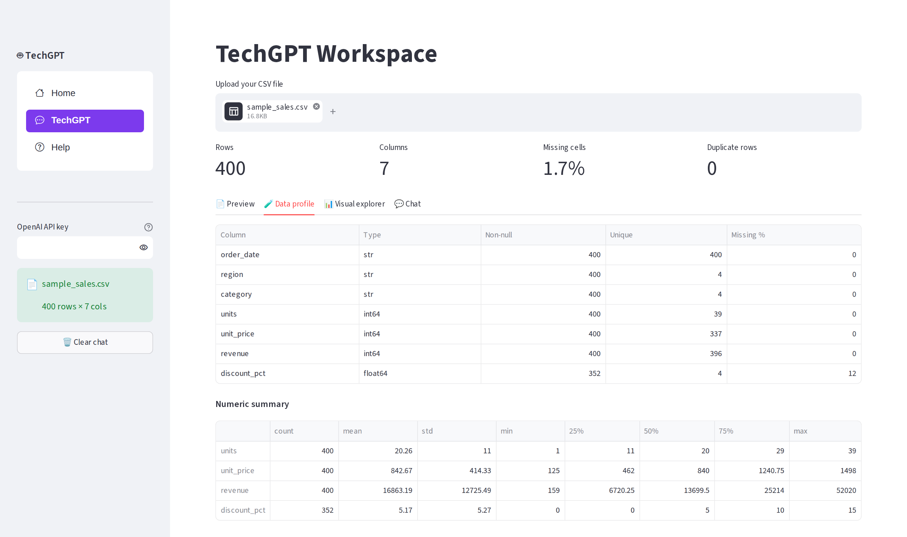
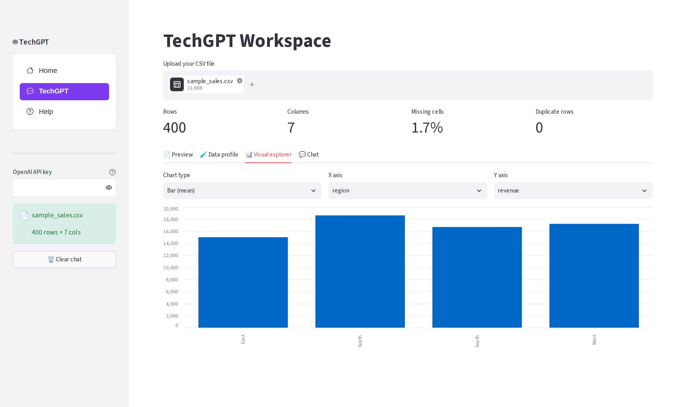
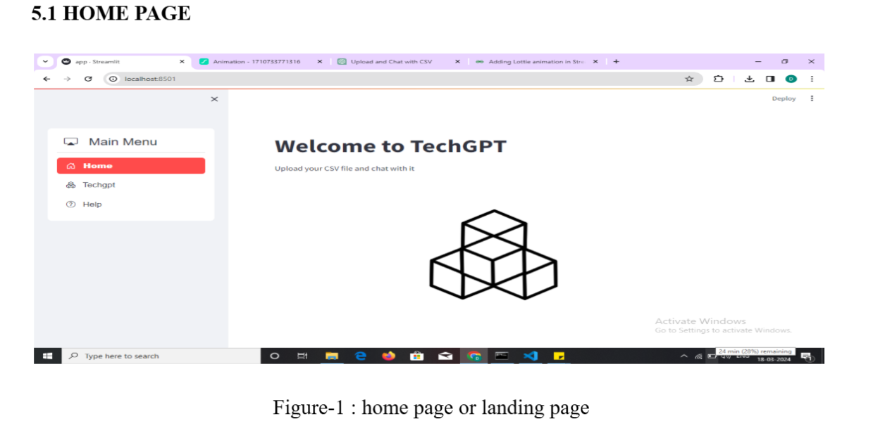
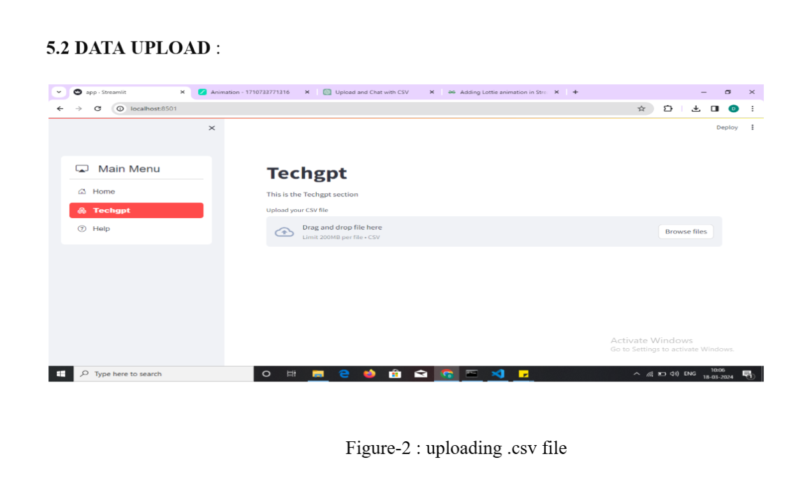
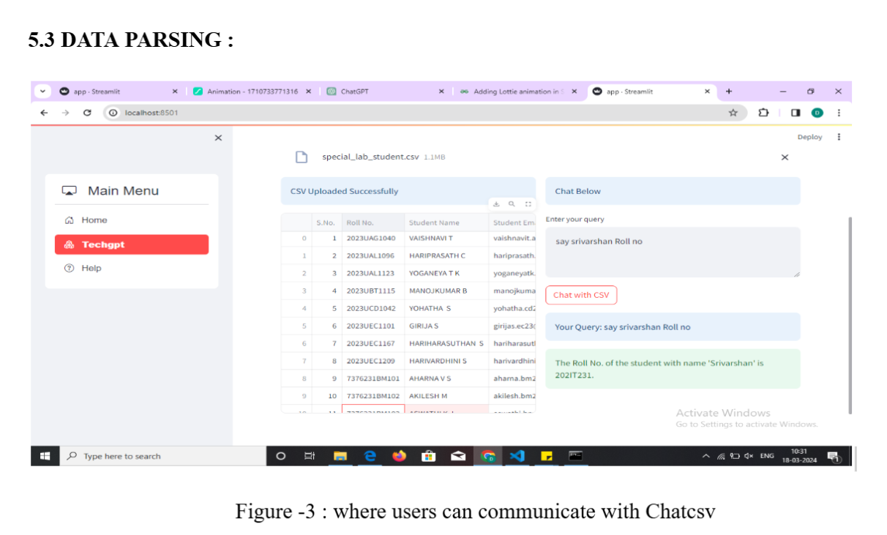
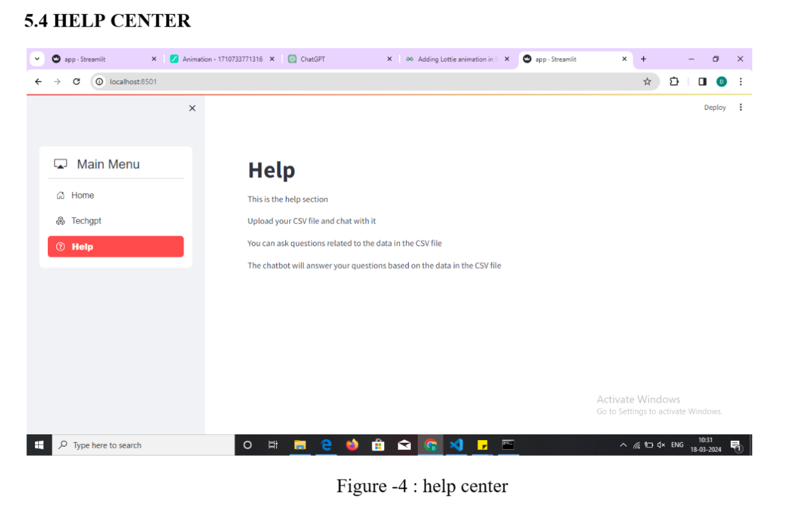

# 📊 TechGPT – Chat with Your CSV Data



**TechGPT** is a Streamlit-based web application that enables users to interactively explore and analyze CSV datasets using natural language queries. By uploading a CSV file, users can profile their data, visualise it, and ask questions in plain English, with answers powered by OpenAI's GPT model through PandasAI.

---

## 🚀 Features

- **Natural Language Interaction**: Query your data using everyday language without writing code.
- **Instant Data Profile**: Row/column counts, missing values, duplicates, column types and numeric summaries.
- **Visual Explorer**: Built-in bar, line, scatter and histogram charts.
- **Chat Interface**: Conversation history, suggested questions and chat export.
- **Secure API Handling**: API key read from a `.env` file or a password field, never hard-coded.
- **Clean, Professional UI**: Sidebar navigation, tabs, metric cards and a modern home page.

---

## 🛠️ Tech Stack

- **Frontend**: [Streamlit](https://streamlit.io/) + streamlit-option-menu
- **Backend**: Python
- **AI Layer**: PandasAI + OpenAI GPT (via API)
- **Data Handling**: Pandas, NumPy

---

## 📸 Screenshots

### 🏠 Home


### 🧪 Data Profile


### 📊 Visual Explorer


<details>
<summary>🕘 Earlier version of the interface</summary>

### 🖥️ Main Interface


### 📁 Upload CSV File


### 🤖 Ask Questions


### ❓ Help Centre


</details>

> Profile and chart screenshots use a sample sales dataset.

---

## 📂 Installation & Setup

1. **Clone the Repository**:
```bash
   git clone https://github.com/DANUSHMATHI2002/TechGPT.git
   cd TechGPT
```

2. **Create a Virtual Environment** (optional but recommended):
```bash
   python -m venv venv
   source venv/bin/activate  # On Windows: venv\Scripts\activate
```

3. **Install Dependencies**:
```bash
   pip install -r requirements.txt
```

4. **Set Up OpenAI API Key**:
   - Obtain your API key from [OpenAI](https://platform.openai.com/account/api-keys).
   - Create a `.env` file in the project root directory and add:
```env
     OPENAI_API_KEY=your_api_key_here
```
   - Make sure `.env` is listed in `.gitignore` so your key is never uploaded.

5. **Run the Application**:
```bash
   streamlit run app.py
```

6. **Access the App**:
   - Navigate to `http://localhost:8501` in your web browser.

---

## 🤖 How It Works

1. **Upload CSV**: Users upload a CSV file containing their dataset.
2. **Explore**: Review the data profile and build quick charts.
3. **Ask Questions**: Users type natural language questions about the data.
4. **Get Answers**: PandasAI turns the question into code, runs it on the dataframe, and returns a table, chart or text answer.

---

## 📈 Example Use Cases

- **Data Exploration**: Quickly understand the contents and structure of your dataset.
- **Statistical Analysis**: Obtain summaries, averages, and other statistical insights.
- **Data Cleaning**: Identify missing values or anomalies in the data.
- **Custom Queries**: Ask specific questions tailored to your dataset's context.

---

## 🧾 See the Video Demo

Check Here: https://drive.google.com/file/d/1dQ7Dsz2vjFC8KtG_jzFYmQ2A_ciABwXI/view?usp=sharing

---

## 🙋‍♂️ Author

Developed by [Danushmathi P](https://github.com/DANUSHMATHI2002).  
Feel free to connect on [LinkedIn](https://www.linkedin.com/in/danushmathip/).

---
